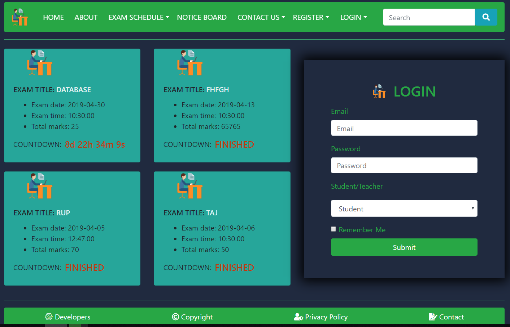
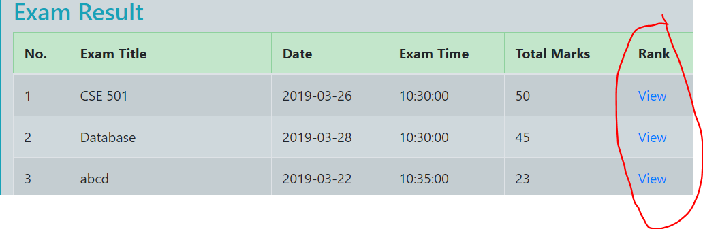
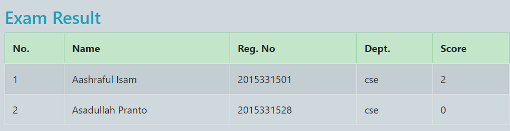
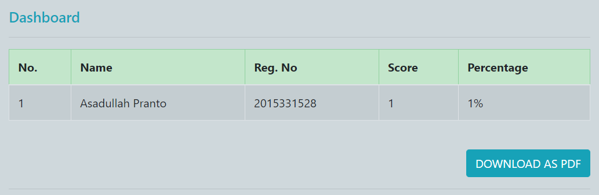

# Online Exam Management System
## Homepage

## Key Features:

### There are two Registration option:
 #### 1. One for Teacher.
 #### 2. Another for Student.
    
### Teacher Registration
#### Step-1:

#### Step-2: 

 
### After successful registration you can login:

### Login As A teacher:
   
    
   ### Dashboard
   
   
    
   #### 1. You can host any exam(as a teacher)
   
   
    
   #### 2. You can Update or delete any exam or question
   
    
   #### 3. You can download total participated student list along with their rank/score(.pdf)
   
   
   
   
   
    
   #### 4. You can download Question paper as PDF(.pdf)

### Student Registration

 
### After successful registration you can login:

### Login As a Student
   
   
   #### 1. You can see all exams(upcoming, ongoing, previous) hosted by any teacher\
   
   
   
   #### 2. You can parcipate in previous and ongoing exam.
   
   
   ##### Your score will be saved only for ongoing exam. Otherwise your score will not be updated, but you can see your current given exam result in the console.
   
   
   
   #### 3. You can see the student list who participated for the exam along with their score.\
   
   
   #### 4. you can see the homework list and homework result.
   
## Database Schemas
  
